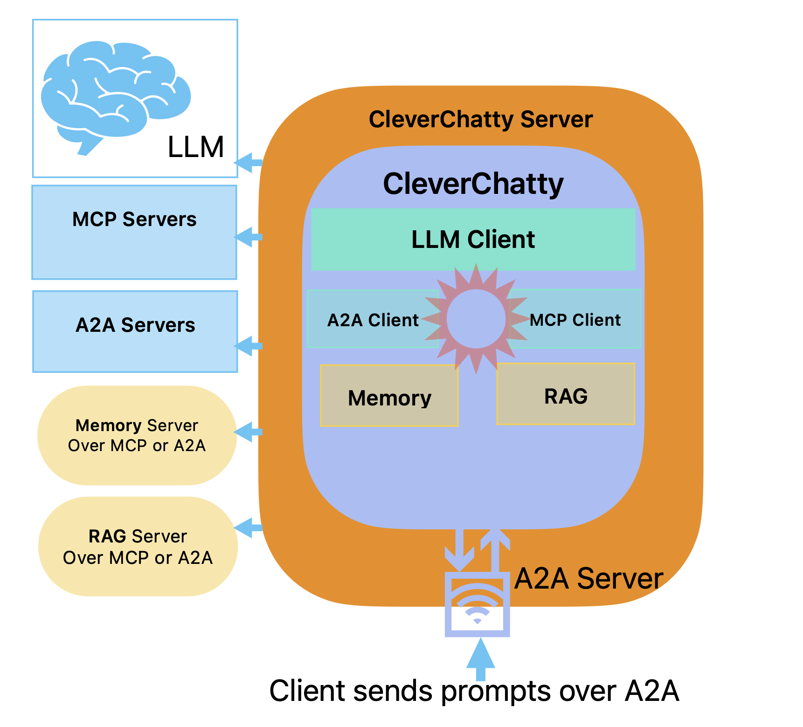

# CleverChatty

**CleverChatty** is a Go package that implements the core functionality of an AI chat system. It encapsulates all business logic required for an AI-powered chat, while remaining independent of any specific user interface.

Also, this package includes the CleverChatty Server, which can be started as a daemon and service many clients with A2A protocol. The server is designed to handle requests from various clients, humans or AI agents, and it can be used to manage multiple AI models and MCP servers.


## Key Features

- Unified backend logic: Provides a single source of truth for AI chat behavior, making it easy to maintain and test.
- LLM prompt handling: Send prompts and receive responses from supported large language models.
- MCP server support: Built-in support for MCP servers as part of the chat infrastructure.
	- Supports all MCP server types: STDIO, HTTP, and SSE.
- A2A protocol: Implements the A2A (Agent-to-Agent) protocol for communication between AI agents and clients. It can work as A2A server and as a client for the A2A protocol to send requests to other A2A servers.
	- It can use other A2A servers as tools with same way as MCP servers.
- AI Memory services support. For example Mem0 or any other memory service that supports MCP or A2A protocols.
- RAG (Retrieval-Augmented Generation) support: Allows AI agents to access external knowledge bases and documents.

## Usage

This package is ideal for developers building custom UIs (e.g., CLI, web, mobile) that require AI chat capabilities without duplicating logic across implementations.

### CleverChatty server

The CleverChatty server is a standalone service that can be run to handle requests from clients using the A2A protocol. It allows you to manage AI models and MCP servers, providing a centralized point for AI interactions.

To install the CleverChatty server, you can use the following command:

```bash
go install github.com/gelembjuk/cleverchatty/cleverchatty-server@latest
```

To start it as a server, you can use the command: 

```bash
cleverchatty-server start --directory "../agent-filesystem"
```

The `--directory` option specifies the directory where the server configuration file is stored. This directory becomes a work directory for the server, and it is used to store logs and other files related to the server's operation. For example, MCP servers for STDIO can be stored there too.

The directory has to contain a valid configuration file named `cleverchatty_config.json`. See [Configuration](docs/Config.md) for more details on how to configure the server. The name of the file can be changed with the `--config` option.

To stop the server, you can use the command:

```bash
cleverchatty-server stop --directory "../agent-filesystem"
```

Also, it is possible to run it interactively:

```bash
cleverchatty-server run --directory "../agent-filesystem"
```



It is possible to run multiple CleverChatty servers on the same machine, each with its own configuration and work directory. This allows you to manage different AI models and MCP servers independently. Just do not forget to use different ports for each server.

See [Configuration](docs/Config.md) for more details on how to configure the server.

## UI for CleverChatty

For now there is only one UI available for CleverChatty, which is the [CleverChatty CLI](docs/Cli.md). It is a command line interface that allows you to interact with the CleverChatty server or run it as a standalone tool.

The CleverChatty CLI can be used in two modes:
- As a standalone tool that runs locally and communicates with LLMs and MCP servers.
- As a client for the CleverChatty server, which allows you to connect to a remote CleverChatty server and use its capabilities without managing models or MCP servers locally.

## Models 

The package works with any models supports by Ollama. Also: OpenAI, Anthropic and Google models by APIs. The model is provided in the format: `provider:model`

Supported providers:

- `ollama` - Ollama models
- `anthropic` - Anthropic models
- `openai` - OpenAI models
- `google` - Google models

Examples:

- `ollama:llama2:7b` - Ollama model
- `anthropic:claude-2` - Anthropic model
- `openai:gpt-3.5-turbo` - OpenAI model
- `google:bert` - Google model

## Running a server

To run a CleverChatty server, you can use the `cleverchatty-server` package. It provides a simple way to start a server that can handle requests from clients using the A2A protocol.

Quick run of the server. It is needed to install it first:

```bash
git clone https://github.com/gelembjuk/cleverchatty.git
cd cleverchatty/cleverchatty-server
go build
./cleverchatty-server start --directory /path/to/directory
```

`/path/to/directory` where the server config is stored.  

To stop the server, you can use the command:

```bash
./cleverchatty-server stop --directory /path/to/directory
```

Or you can run it interactively:

```bash
./cleverchatty-server run --directory /path/to/directory
```

## More Information

- [Cli documentation](docs/Cli.md) - details about the CleverChatty CLI, how to use it and how to run it as a client for the CleverChatty server.
- [Configuration documentation](docs/Config.md) - details about the configuration of the CleverChatty server and how to set it up.
- [Custom Agents documentation](docs/CustomAgents.md) - how to build custom agents using the CleverChatty platform.
- [Interfaces documentation](docs/Interfaces.md) - details about the interfaces supported by CleverChatty, including RAG and memory interfaces.

## Credits

The first version of this application was the copy of [mcphost](https://github.com/mark3labs/mcphost) refactored to remove the UI.