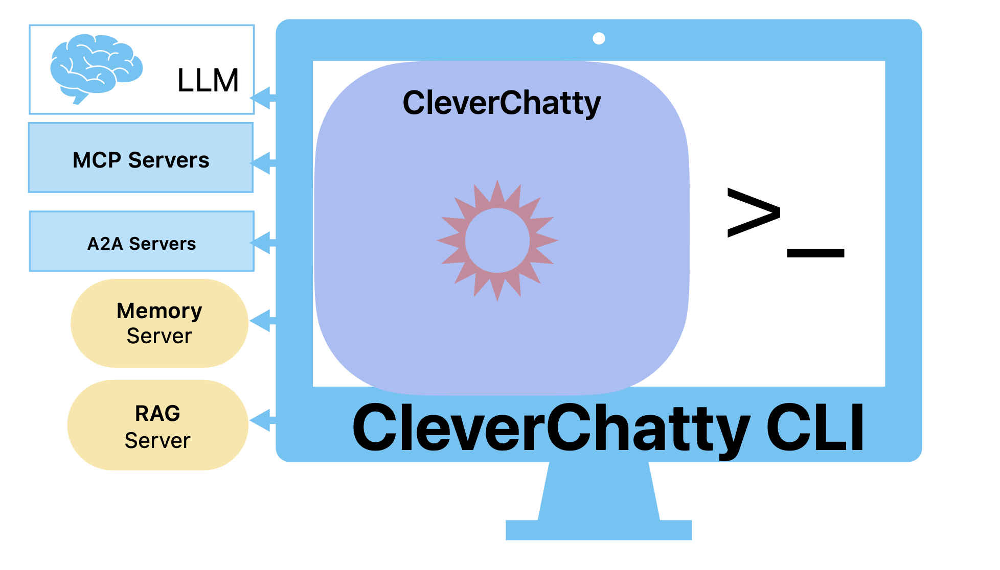
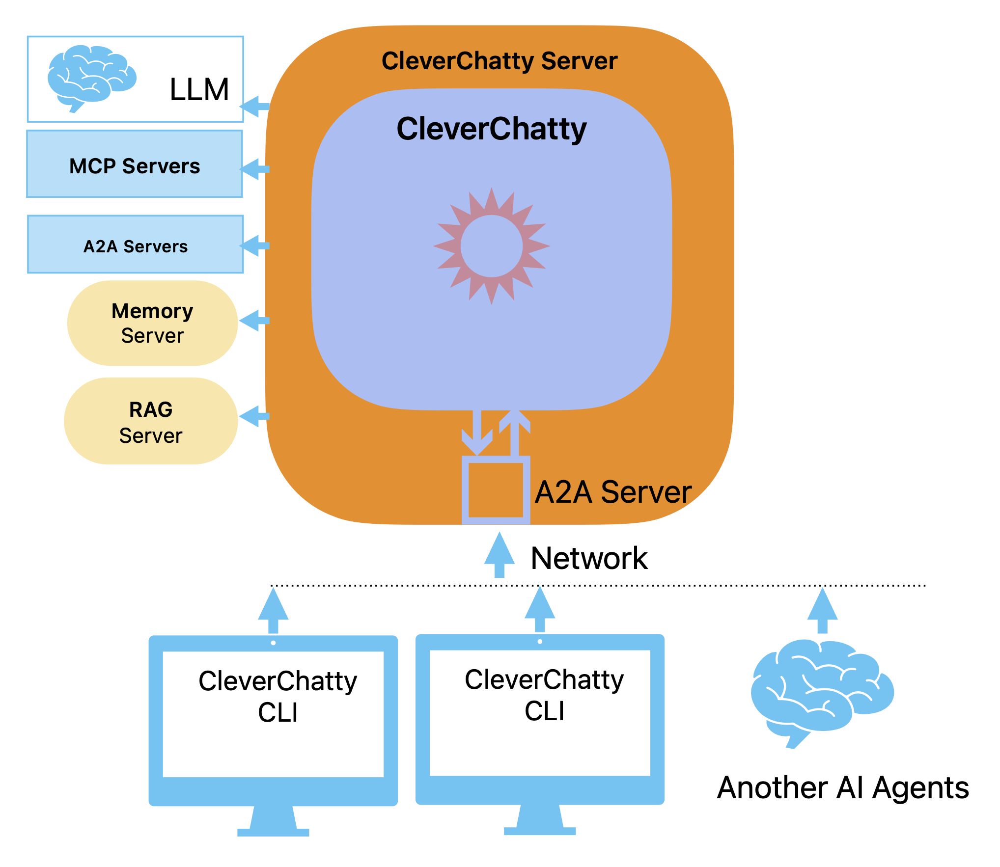

# CleverChatty CLI

The CleverChatty CLI is a command-line interface tool that allows users to interact with the CleverChatty server or run it as a standalone AI chat client.

## Table of Contents

- [Features](#features)
- [Installation](#installation)
- [Quick run in standalone mode](#quick-run-in-standalone-mode)
    - [With command line arguments](#with-command-line-arguments)
    - [Use the config file](#use-the-config-file)
    - [Hybrid Mode](#hybrid-mode)
- [Use as UI for the CleverChatty server](#use-as-ui-for-the-cleverchatty-server)

## Features

- Chat with various AI models through a unified interface
- Support for multiple AI model providers: Ollama, OpenAI, Anthropic, Google
- Support for external tool calls using MCP and A2A protocols
- Support of external memory servers (over MCP interface as well as A2A interface)
- Support of Retrieval-Augmented Generation (RAG) servers (over MCP interface as well as A2A interface)
- Configurable using a JSON file

## Installation

This tool is written in Go and can be installed using `go install` command.

Install the CLI tool using the following command:

```bash
go install github.com/gelembjuk/cleverchatty/cleverchatty-cli@latest
```

Install the server using the following command:

```bash
go install github.com/gelembjuk/cleverchatty/cleverchatty-server@latest
```

It will be installed in your `$GOPATH/bin` directory, so make sure it is in your `PATH`.

## Quick run in standalone mode



It is possible to test it without installing it. You can run it directly from the repository using `go run` command.

### With command line arguments

In standalone mode, the CLI can be used to chat with AI models without connecting to a server. The tool includes the server internally and it works while the interactive session is running. The user can specify the model to use, and the CLI will handle the chat interactions.

It is the quick way to run A chat with AI models without the need to set up a server. In this mode, the user can specify the model to use, configure tools servers (MCP and A2A servers), connect Memory or RAG servers, and chat with the AI model directly.

Presume, you have a model installed with ollama, for example, `qwen2.5:3b`.

To chat with this model.

```
go run github.com/gelembjuk/cleverchatty/cleverchatty-cli@latest -m ollama:qwen2.5:3b
```

Or, when you clone the repo, you can run it with:

```
cd cleverchatty-cli
go build
./cleverchatty-cli -m ollama:qwen2.5:3b
```

Or when you have installed it, you can run it with:

```bash
cleverchatty-cli --model ollama:llama2:7b 
```

or with some other model, for example, `anthropic:claude-2`:

```bash
cleverchatty-cli --model anthropic:claude-2 --anthropic-api-key YOUR_ANTHROPIC_API_KEY
```

### Use the config file

This tool is really useful when you use some MCP servers. It is possible by creating a config file and adding the list of MCP servers to it.

Basic config file `config.json` example:

```json
{
    "agent_id":"my_id",
    "log_file_path": "",
    "model": "ollama:qwen2.5:3b",
    "system_instruction":"You are the helpful assistant.",
    "tools_servers": {
        "LocalFileSystem": {
            "command": "mcp/mcp-local-tree",
            "args": [],
            "env": {
                "WORKSPACE_FOLDER": "/path/to/project/folder"
            }
        },
        "FilesExpert":{
            "endpoint":"http://a2a_ai_assistant_host:8081/",
            "metadata":{
                "agent_id":"{AGENT_ID}"
            }
        }
    }
}
```

To run the chat using this config stored in the `config.json`, you can use the command:

```
go run github.com/gelembjuk/cleverchatty/cleverchatty-cli@latest --config config.json
```

### Hybrid Mode

In the hybrid mode, it is possible to use the config file and inline arguments together. This allows for more flexibility in configuring the CLI while still being able to quickly override settings from the command line.

For example, a model in the config is set to `ollama:llama2:7b`, but you want to use a different model for a specific session. You can do this by specifying the model in the command line:

```bash
cleverchatty-cli --config /path/to/config.json --model anthropic:claude-2 --anthropic-api-key YOUR_ANTHROPIC_API_KEY --agentid user123
```

## Use as UI for the CleverChatty server



In client mode, the CLI connects to a CleverChatty server. This allows users to interact with the server and use its capabilities without managing models or MCP servers locally.

The server can be run anywhere in the network, and the CLI will connect to it using the provided server address and agent ID. 

Agent ID is used to identify the user in the CleverChatty server. It is not always required, it depends if the server is configured to require user identification. In most cases it would be required.

Presume, you have a CleverChatty server running on `somehost:8000` (it is the A2A protocol server), you can run the CLI tool as a client for the server:

```
go run github.com/gelembjuk/cleverchatty/cleverchatty-cli@latest --server http://somehost:8000 --agentid user123
```

Or when you have installed it, you can run it with:

```bash
cleverchatty-cli --server http://somehost:8000 --agentid user123
```

In this mode you do not need to specify a model, to install and manage it, as the server will handle the request.

